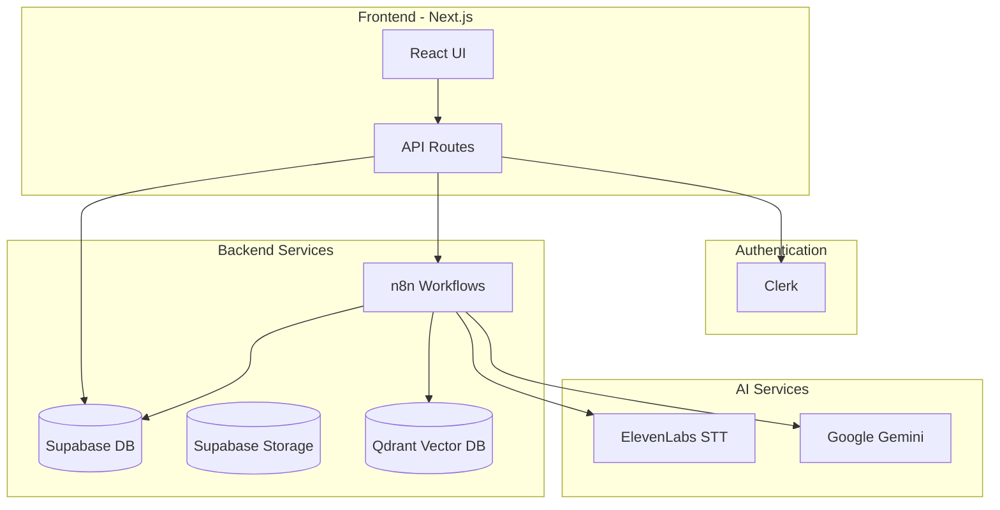
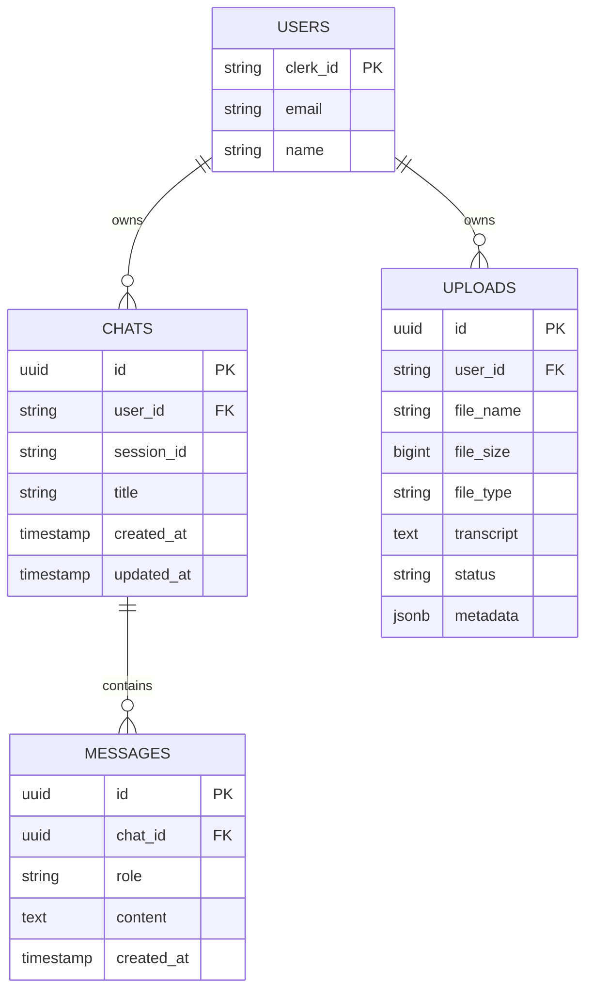
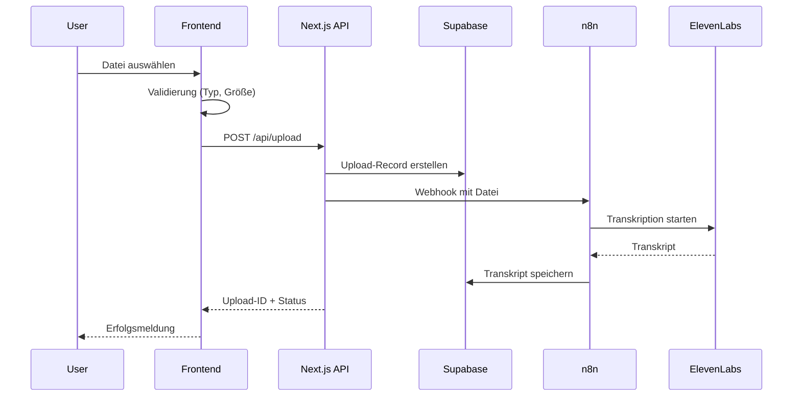
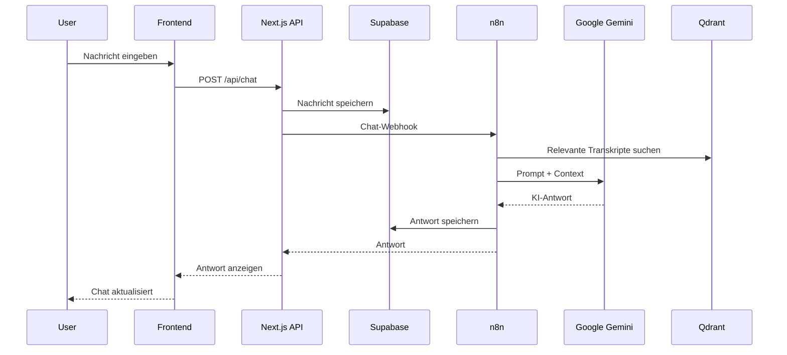

# TiMax - Product Requirements Document (PRD)

## 1. Executive Summary

**TiMax** ist eine deutschsprachige SaaS-Plattform, die Audio- und Video-Inhalte automatisch transkribiert und mittels KI in strukturierte Text-Formate (LinkedIn-Posts, Newsletter, Blog-Artikel) umwandelt.

**Kernbotschaft:** "Du hast was zu sagen. TiMax hilft dir, es aufzuschreiben."

---

## 2. Problem & Lösung

### Das Problem

Du hast Videos oder Audios aufgenommen, aber:
- Dein Wissen bleibt "gefangen" in der Aufnahme
- Niemand schaut sich 1-Stunden-Videos an
- Du weißt, du könntest daraus Posts machen – aber der Aufwand ist zu groß
- Selbst hinsetzen und alles abtippen? Keine Zeit.

### Die Lösung

TiMax macht aus deinen Videos und Audios **fertige Texte** – LinkedIn-Posts, Newsletter, Blog-Artikel.

**Authentisch:** Deine Worte, deine Ideen – nur schneller formatiert.

**Einfach:** Video hochladen → Transkript → Mit KI in Text verwandeln.

---

## 3. Zielgruppe

### Für wen ist TiMax?

Für Menschen, die **Wissen in Videos oder Audios haben** und daraus Texte machen wollen.

Du erkennst dich wieder, wenn du:
- Einen **Podcast** aufnimmst und daraus LinkedIn-Posts machen willst
- **Videos** drehst und einen Newsletter daraus schreiben möchtest
- **Vorträge oder Workshops** hältst und das Wissen nicht verloren gehen soll
- **Sprachmemos** mit Ideen aufnimmst und sie endlich ausformulieren willst

### Was du daraus machen kannst

| Du hast... | Daraus wird... |
|------------|----------------|
| Podcast-Episode | LinkedIn-Posts, Newsletter |
| Video | Blog-Artikel, Social Media Posts |
| Vortrag/Workshop | Zusammenfassung, Artikel-Serie |
| Sprachmemo | ausformulierter Text, Post |
| Interview | Zitate, Zusammenfassung |

---

## 4. Funktionen & Features

### 4.1 Öffentliche Seiten

- **Landing Page** (`/`) - Hero, Features, Workflow, Testimonials, Pricing-Teaser
- **Pricing** (`/pricing`) - Drei Tarife mit Feature-Vergleich
- **Rechtliche Seiten** - AGB, Datenschutz, Impressum, Widerruf, Cookies

### 4.2 User-Features (authentifiziert)

- **Upload** (`/upload`)
  - Unterstützte Formate: MP3, MP4, WAV, M4A, WebM
  - Max. Dateigröße: 100MB
  - Automatische Transkription via n8n + ElevenLabs

- **Uploads-Übersicht** (`/uploads`)
  - Liste aller Transkripte
  - Status-Anzeige (Pending, Processing, Completed, Failed)

- **Chat** (`/chat`)
  - KI-Dialog basierend auf Transkripten
  - Persistente Chat-Historie
  - Content-Generierung (LinkedIn, Newsletter, Blog)
  - Beispiel-Prompts für Einsteiger

### 4.3 Admin-Features

- **Dashboard** (`/admin`) - Statistiken, letzte Aktivitäten
- **Chats verwalten** (`/admin/chats`) - Alle Chats einsehen/löschen
- **Uploads verwalten** (`/admin/uploads`) - Alle Uploads einsehen/löschen
- **User verwalten** (`/admin/users`) - Nutzerliste mit Statistiken

---

## 5. Architektur & Tech Stack

### 5.1 Frontend

| Technologie | Version | Zweck |
|-------------|---------|-------|
| Next.js | 16.1.5 | App Router Framework |
| React | 19.2.4 | UI Library |
| TypeScript | 5.x | Type Safety |
| Tailwind CSS | 4.x | Styling |
| shadcn/ui | New York | Component Library |
| Framer Motion | 12.x | Animationen |
| Lucide React | 0.563.x | Icons |

### 5.2 Backend & Services

| Service | Zweck |
|---------|-------|
| **Clerk** | Authentifizierung (inkl. deutscher Lokalisierung) |
| **Supabase** | PostgreSQL-Datenbank + File Storage |
| **n8n** | Workflow-Automatisierung (Transkription + Chat) |
| **Qdrant** | Vector-Datenbank für Knowledge Base |
| **ElevenLabs** | Speech-to-Text (Whisper API) |
| **Google Gemini** | LLM für Chat + Embeddings |
| **Upstash Redis** | Rate Limiting |
| **Sentry** | Error Tracking |
| **Vercel** | Hosting + Cron Jobs |

### 5.3 Architektur-Diagramm



---

## 6. Datenmodell

### 6.1 Tabellen

**chats**

| Spalte | Typ | Beschreibung |
|--------|-----|--------------|
| id | UUID | Primary Key |
| user_id | TEXT | Clerk User ID |
| session_id | TEXT | Session für Memory |
| title | TEXT | Chat-Titel |
| created_at | TIMESTAMPTZ | Erstelldatum |
| updated_at | TIMESTAMPTZ | Letzte Änderung |

**messages**

| Spalte | Typ | Beschreibung |
|--------|-----|--------------|
| id | UUID | Primary Key |
| chat_id | UUID | FK zu chats |
| role | TEXT | 'user', 'assistant', 'system' |
| content | TEXT | Nachrichteninhalt |
| created_at | TIMESTAMPTZ | Erstelldatum |

**uploads**

| Spalte | Typ | Beschreibung |
|--------|-----|--------------|
| id | UUID | Primary Key |
| user_id | TEXT | Clerk User ID |
| file_name | TEXT | Original-Dateiname |
| file_size | BIGINT | Größe in Bytes |
| file_type | TEXT | MIME-Type |
| transcript | TEXT | Transkribierter Text |
| status | TEXT | pending/processing/completed/failed |
| metadata | JSONB | Topics, Intention, Tone etc. |

### 6.2 Entity Relationship Diagram



---

## 7. API-Spezifikation

### 7.1 Chat APIs

| Methode | Endpoint | Beschreibung |
|---------|----------|--------------|
| GET | `/api/chats` | Alle Chats des Users |
| POST | `/api/chats` | Neuen Chat erstellen |
| GET | `/api/chats/[id]` | Chat mit Nachrichten abrufen |
| PATCH | `/api/chats/[id]` | Chat aktualisieren (Titel) |
| DELETE | `/api/chats/[id]` | Chat löschen |
| POST | `/api/chat` | Nachricht senden + KI-Antwort |

### 7.2 Upload APIs

| Methode | Endpoint | Beschreibung |
|---------|----------|--------------|
| GET | `/api/uploads` | Alle Uploads des Users |
| POST | `/api/upload` | Datei hochladen |
| GET | `/api/uploads/[id]` | Upload-Details |
| DELETE | `/api/uploads/[id]` | Upload löschen |

### 7.3 Admin APIs

| Methode | Endpoint | Beschreibung |
|---------|----------|--------------|
| GET | `/api/admin/stats` | Plattform-Statistiken |
| GET | `/api/admin/chats` | Alle Chats (paginiert) |
| GET | `/api/admin/uploads` | Alle Uploads (paginiert) |
| GET | `/api/admin/users` | Alle User mit Stats |

---

## 8. Design System - Editorial Modernism

### 8.1 Design-Philosophie

- **Brutalistisch** - Scharfe Schatten statt Blur/Glow
- **Typografisch** - Klare Hierarchie mit Serif-Headlines
- **Luxuriös** - Bronze-Akzentfarbe als Premium-Element
- **Minimalistisch** - Großzügiger Weißraum

### 8.2 Farbpalette

**Light Mode:**

| Farbe | Hex | Verwendung |
|-------|-----|------------|
| Background | `#F8F7F4` | Warmes Editorial-Papier |
| Foreground | `#1A1A1A` | Text |
| Primary | `#9A6F4F` | Bronze (Buttons, Akzente) |
| Secondary | `#E8E6E1` | Hintergründe |
| Muted | `#666461` | Sekundärtext |
| Destructive | `#B23A2F` | Fehler/Löschen |
| Border | `#D4D2CC` | Rahmen |

**Dark Mode:**

| Farbe | Hex | Verwendung |
|-------|-----|------------|
| Background | `#0F0F0F` | Near-Black |
| Foreground | `#EFEDE8` | Text |
| Primary | `#D4A574` | Helleres Bronze |
| Secondary | `#242424` | Hintergründe |

### 8.3 Typografie

| Schrift | Font | Verwendung |
|---------|------|------------|
| Serif | Crimson | Headlines, Editorial-Elemente |
| Sans-Serif | DM Sans | Body-Text, UI-Elemente |
| Mono | JetBrains Mono | Code, technische Inhalte |

### 8.4 Schatten-System

- `shadow-editorial-sm` - Subtiler Schatten
- `shadow-editorial-md` - Standard
- `shadow-editorial-lg` - Prominent
- `shadow-editorial-brutalist` - 8px Offset

### 8.5 Komponenten-Übersicht

| Kategorie | Komponenten |
|-----------|-------------|
| **ui/** | Button, Card, Input, Badge, Dialog, Sheet, Toast, Progress, Skeleton |
| **chat/** | ChatInterface, ChatSidebar, ChatHeader, ChatInput, MessageList, MessageBubble |
| **upload/** | FileUpload, UploadList |
| **layout/** | MainNavigation, Footer, Breadcrumbs, CookieConsent |
| **home/** | HeroSection, StatsSection, Testimonials, EmailSignup |
| **admin/** | AdminSidebar, ChatsTable, UploadsTable, UsersTable, StatsCards |

---

## 9. Sicherheit

### 9.1 Authentifizierung

- **Provider:** Clerk (Managed Auth)
- **Protected Routes:** `/chat`, `/upload`, `/uploads`, `/admin/*`
- **Admin-Zugriff:** `publicMetadata.role === "admin"`

### 9.2 CSRF-Schutz

- Token-basiert via `/api/csrf`
- Required auf POST/PATCH/DELETE

### 9.3 Rate Limiting

| Endpoint | Limit |
|----------|-------|
| `/api/upload` | 5 req/Stunde |
| `/api/chat` | 20 req/Minute |
| `/api/generate` | 10 req/Stunde |
| Default | 100 req/Minute |

### 9.4 Datenisolierung

- Alle DB-Queries filtern nach `user_id`
- RLS als zusätzliche Sicherheitsschicht
- Storage-Bucket nach User-Ordnern strukturiert

---

## 10. Preismodell

| Plan | Preis/Monat | Jährlich | Features |
|------|-------------|----------|----------|
| **Starter** | 29€ | 290€ (2 Monate gratis) | 10 Uploads, 2h Transkription, 100 KI-Anfragen |
| **Pro** | 49€ | 490€ (2 Monate gratis) | 50 Uploads, 10h Transkription, 500 KI-Anfragen |
| **Business** | 79€ | 790€ (2 Monate gratis) | Unbegrenzt Uploads, 30h Transkription, Unbegrenzte KI-Anfragen |

### Feature-Details

| Feature | Starter | Pro | Business |
|---------|---------|-----|----------|
| Uploads/Monat | 10 | 50 | Unbegrenzt |
| Transkription | 2 Stunden | 10 Stunden | 30 Stunden |
| KI-Chat Anfragen | 100 | 500 | Unbegrenzt |
| Textformate | Alle | Alle | Alle |
| Support | E-Mail | Priorität | Persönlich |
| 14-Tage Geld-zurück | Ja | Ja | Ja |

---

## 11. User Flows

### 11.1 Upload-Flow



### 11.2 Chat-Flow



---

## 12. Environment Variables

### Required

```env
# Supabase
NEXT_PUBLIC_SUPABASE_URL=https://xxx.supabase.co
NEXT_PUBLIC_SUPABASE_ANON_KEY=eyJ...
SUPABASE_SERVICE_ROLE_KEY=eyJ...

# Clerk
NEXT_PUBLIC_CLERK_PUBLISHABLE_KEY=pk_...
CLERK_SECRET_KEY=sk_...
NEXT_PUBLIC_CLERK_SIGN_IN_URL=/sign-in
NEXT_PUBLIC_CLERK_SIGN_UP_URL=/sign-up

# n8n Webhooks
N8N_CHAT_WEBHOOK_URL=https://xxx.n8n.cloud/webhook/timax-chat
N8N_UPLOAD_WEBHOOK_URL=https://xxx.n8n.cloud/webhook/timax-upload

# Cron
CRON_SECRET=xxx
```

### Optional

```env
# Sentry
SENTRY_DSN=https://xxx@sentry.io/xxx

# Upstash Redis
UPSTASH_REDIS_REST_URL=https://xxx.upstash.io
UPSTASH_REDIS_REST_TOKEN=xxx

# Rate Limits
RATE_LIMIT_UPLOAD_MAX=5
RATE_LIMIT_CHAT_MAX=20
```

---

## 13. Deployment

- **Hosting:** Vercel
- **Domain:** timax.xyz
- **Auth Domain:** clerk.timax.xyz
- **Cron Jobs:** `/api/cron/cleanup` (täglich 2:00 UTC)
- **Data Retention:**
  - Uploads ohne Transkript: 7 Tage
  - Inaktive Transkripte: 90 Tage

---

## 14. Nächste Schritte

1. Legal-Seiten mit echten Firmendaten befüllen
2. Upstash Redis für Production konfigurieren
3. Payment-Integration (Stripe) für Pricing-Pläne
4. E-Mail-Benachrichtigungen bei Upload-Fertigstellung
5. Export-Funktionen (PDF, Markdown)
6. Team-Features für Business-Plan
